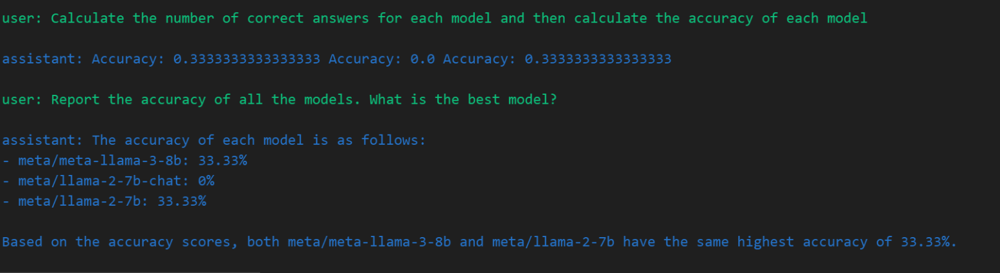

# llm-agents-uplifting

## Main results
I put together a workflow using function calling as scaffolding, and decomposed the workflow of the agent into sub-tasks and for each subtask I provided with an appropriate function the agent can use to respond. I primarily used GPT-3.5-turbo as the agent. I could not collect the results I wanted as I ran out of openai api credits, so this is perhaps the most important takeaway: manage the credit limit (even more) wisely! I list some steps I could take towards this in the last section.

* Agent could sample the correct number of questions
* Agent <b>could not</b> ask each model all the sampled questions most of the time
* Agent could usually check if the model responded with the correct answer for the given question
* Agent <b>could not</b> calculate the number of correct answers. It would ask each model just one question but acts as if it asked the model all the sampled questions.

### Workflow

Initialise the agent conversation with a system prompt setting the overall context.
```python
sys_prompt = {
    "role": "system",
    "content": "You are an agent that quantitatively evaluates exactly three other LLMs on sample MMLU questions. You will call appropriate functions to achieve this goal."
}
```

Below's the workflow I designed for our task. By workflow, I mean the series of steps or sub-tasks that are involved in completing the task.

*   Step 1: Sample questions (I tried with 3 questions)
    ```python
    (f"Sample {n_questions} questions from MMLU dataset.", [sampleQuestionsFromMMLU])
    ```

*   Steps 2 to 5: Ask the sampled questions (one step for each model)
    ```python
    (f"Ask all above {n_questions} questions to the LLM {model} and check their answers. LLM should be asked all {n_questions} with their choices.", [callLLM])
    ```

*   Steps 6 to 8: Calculate the number of correct answers and accuracy (one step for each model)
    ```python
    (f"Calculate the number of correct answers for {model} and then calculate the accuracy of the model", [calculateAccuracy])
    ```

*   Step 9: Report the results
    ```python
    ("Report the accuracy of all the models. What is the best model?", [])
    ```

I could get some non-trivial results with this prompting, for example here is a conversation on the last two steps of the workflow:


Initially, I tried steps 2-5 in one go. That is, ask the agent to evaluate all the three models at once. It would correctly ask for three function calls to ```callLLM``` but the prompt to each call didn't have all the questions. This is the reason I further decomposed this step into three - one for each model.

The agent was struggling to prompt the other models properly with all the three questions. It would often ask each model just one question.

## Difficulties
- Needed even more handholding than initially expected.
- It was hard to make the agent ask all the questions to all the models in one shot. Decomposition made it somewhat better not close to perfection.
- Was hard to keep track of usage, I wasn't able to find endpoints so I could check usage programatically

## Possible next steps and Advice
-   Separate the logic, utility-related functionality from actually calling the enpoints, cheaper to iterate both in terms of money and time
-   Ideally such a separation will provide some abstract interface, where I can use some dummy agent to smoke-test the workflow.
-   I feel we could get more out of the workflow with better prompts. Research more on best practices for prompt engineering, perhaps refer [this prompting guide](https://www.promptingguide.ai/)
-   Since I didn't have access to the account itself (just the api key), I was not able to track the usage. In such cases, estimate an upper bound on the number of tokens we might need for single run. This would be useful to estimate the number of runs you could possibly make for a given budget. Example ways to estimate:
    +   For input, #tokens approximately would be n_questions * max_tokens_per_q + n_instructions * max_tokens_per_instruction
    +   For output, use some max_tokens parameter when calling the APIs
-   Write some minimum functionality to save the evaluation results periodically. It could be just dumping the conversation into a txt file along with some meta-information, like workflow, function calls made, models used etc.
-   Think of a way to evaluate the agent itself. Useful to look for things like
    +   Whether the required number of questions are asked to all the models
    +   Whether the correct answer is hidden from the models
    +   Whether the arguments passed to the functions are making sense
    +   etc.